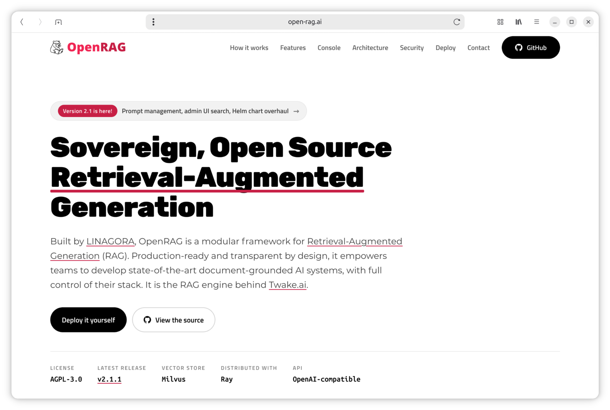

# OpenRAG website

Source of [open-rag.ai](https://open-rag.ai/), the website of
[OpenRAG](https://github.com/linagora/openrag) by [LINAGORA](https://linagora.com/).



It is a static site: plain HTML, CSS and JavaScript, with no build step and no
external dependency. Every asset is served from this repository.

```
index.html      the single page
css/            stylesheet
js/             behaviour (no framework)
fonts/          self-hosted web fonts
images/         illustrations, social card, screenshot
images/logos/   third-party and LINAGORA marks
video/          embedded demonstration video
tools/          helper scripts, run by hand (see below)
robots.txt      crawler directives
sitemap.xml     sitemap referenced by robots.txt
CNAME           production domain
```

## Working locally

Serve the directory over HTTP rather than opening `index.html` from disk:

```sh
python3 -m http.server 8000
```

Then browse to <http://localhost:8000/>.

**Use `localhost`, not your machine's LAN address.** The contact form decrypts
its recipient with the Web Crypto API, which browsers expose only in a *secure
context* — HTTPS, or `localhost` as a special case. Over `http://192.168.x.x` the
form detects this and says an HTTPS connection is required, which is correct
behaviour but makes the form untestable. To test from another device, forward the
port (`ssh -L 8000:localhost:8000 …`) rather than browsing to the LAN IP.

## The contact form

The page publishes no email address. The recipient ships AES-GCM encrypted, and
the key is derived by an iterated PBKDF2 that runs in the visitor's browser when
they tick *I am human* — around a tenth of a second of CPU. Harvesters that do not
execute JavaScript get nothing, and paying that cost per page does not add up at
harvesting scale.

Nothing is withheld from the published constants: the barrier is the work, not
secrecy, so a determined reader still gets there. It is a cost barrier against
indiscriminate scraping, not a secret.

To change the address:

```sh
node tools/encrypt-address.mjs <address>
```

That prints a fresh salt, IV and ciphertext to paste over the `POW_*` constants
in [`js/site.js`](js/site.js). The salt and IV are random each run, so the old
ciphertext reveals nothing about the new one.

## Deployment

The site is deployed to GitHub Pages by the
[`Deploy static content to Pages`](.github/workflows/static.yml) workflow, which
uploads the repository as-is and publishes it.

It runs on every push to `main`, and on demand from the *Actions* tab. There is
no build step and no staging: what is committed is what is served.

> The run is not always created promptly: a push has been seen to land on `main`
> with its workflow run appearing only fourteen minutes later. If the live site
> has not updated, give it a few minutes before concluding anything is wrong.
> **Run workflow** in the *Actions* tab deploys the current `main` on demand, and
> is harmless if the delayed run then arrives as well.

## DNS

The apex domain resolves to GitHub Pages:

| Type | Name | Value |
| ---- | ---- | ----- |
| A | `@` | `185.199.108.153` |
| A | `@` | `185.199.109.153` |
| A | `@` | `185.199.110.153` |
| A | `@` | `185.199.111.153` |
| AAAA | `@` | `2606:50c0:8000::153` |
| AAAA | `@` | `2606:50c0:8001::153` |
| AAAA | `@` | `2606:50c0:8002::153` |
| AAAA | `@` | `2606:50c0:8003::153` |
| CNAME | `www` | `linagora.github.io.` |

`www.open-rag.ai` redirects to the apex, which is the intent. GitHub issued the
certificate for `open-rag.ai` alone, so the redirect is served over HTTP — enough
for a browser reaching `www`, since the apex sets no HSTS. Only a link written
explicitly as `https://www.open-rag.ai` fails, and none point there.

⚠️ **This domain also carries email.** The zone holds `MX` records and an SPF
`TXT` record. Change the `A` and `AAAA` records only — replacing the zone breaks
mail delivery.

## Repository configuration

Set once, not covered by the workflow:

- **Settings → Pages → Build and deployment → Source**: **GitHub Actions**.
- **Settings → Pages → Custom domain**: `open-rag.ai`. The [`CNAME`](CNAME) file
  alone does not set this for Actions-based deployments — the setting does.
- **Settings → Pages → Enforce HTTPS**: enabled.

## Licence

Published under the [GNU Affero General Public License v3.0](LICENSE), like
[OpenRAG](https://github.com/linagora/openrag) itself.
